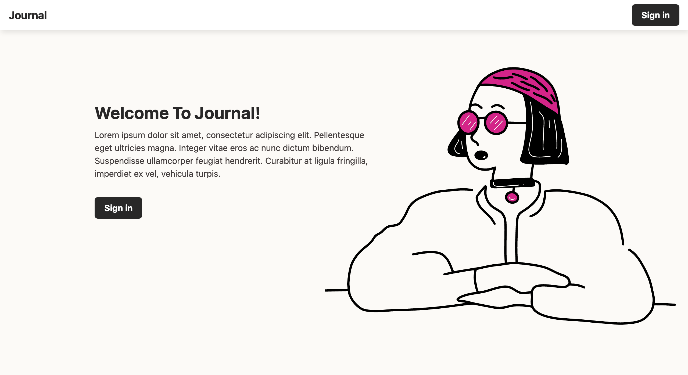
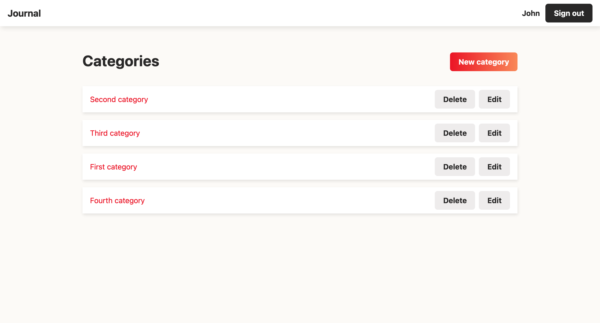
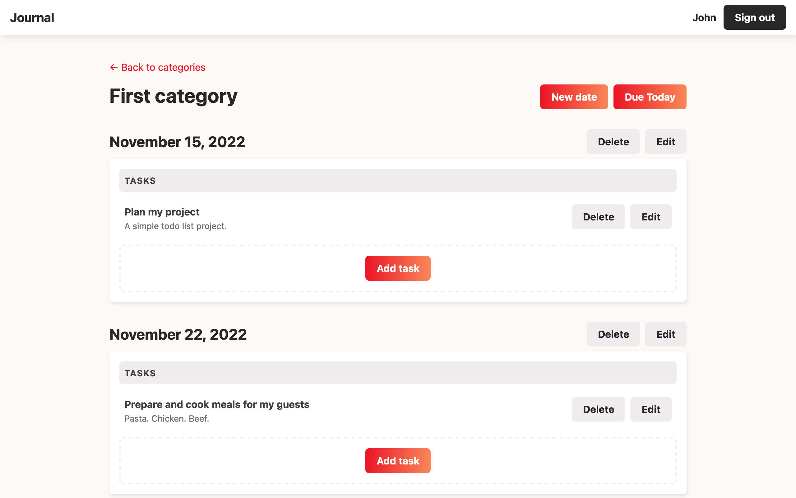

# Journal App

A Ruby on Rails application that allows users to create and manage tasks.

## Tech Stack

- Ruby on Rails
- PostgreSQL
- SASS

## User Login

email: `john@email.com`  
password: `password`

## Live Demo

Render (https://my-journal-app.onrender.com)
